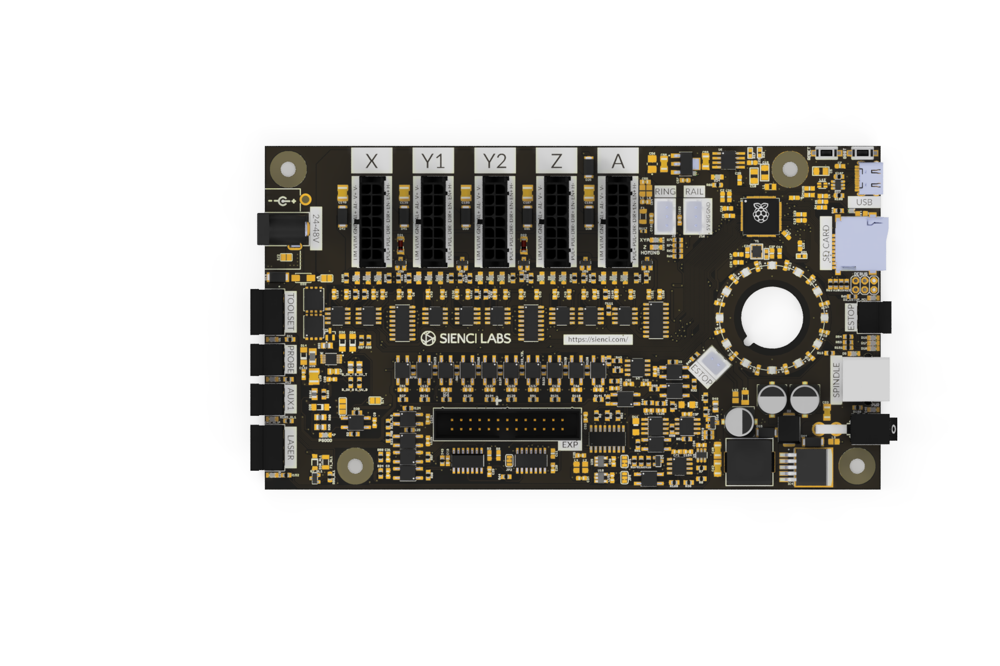

# SuperLongBoard Lite

The **SuperLongBoard Lite (SLB-Lite)** is Sienci Labs’ 24V CNC controller developed for the LongMill MK3, and other similar machines.

## Key Features

* grblHAL-based firmware
* Four-axis motion control
* Closed-loop stepper motor support
* USB connectivity
* SD card support
* Spindle/router and laser control
* Tool-length sensor support
* Auto-squaring
* Expansion interface
* UF2 firmware updates
